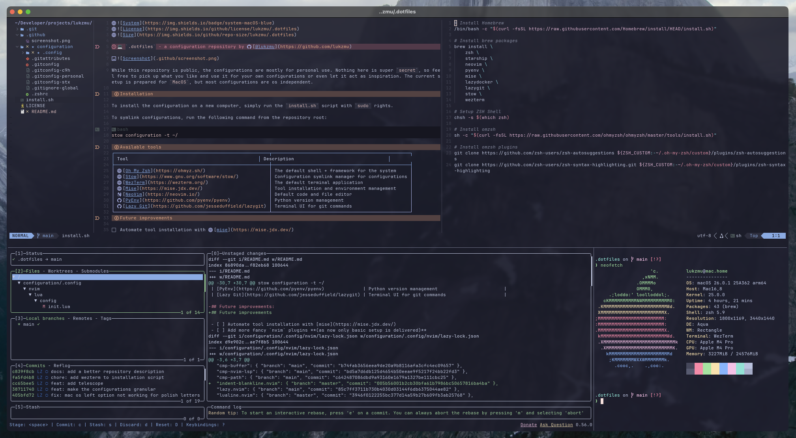

# 💻 `.dotfiles` - a configuration repository by [@lukzmu](https://github.com/lukzmu)



While this repository is public, the configurations are mostly for personal use. Nothing here is super `secret`, so feel free to pick up what you like and use it for your own configurations or even let it act as inspiration. The current setup is prepared for `MacOS`, but most configurations are os independent.

## Installation

To install the configuration on a new computer, simply run the `install.sh` script with `sudo` rights.

To symlink configurations, run the following command from the repository root:

```bash
stow configuration -t ~/
```

## Available tools

| **Tool**                                             | **Description**                                  |
|------------------------------------------------------|--------------------------------------------------|
| [Oh My Zsh](https://ohmyz.sh/)                       | The default shell + framework for the system     |
| [Stow](https://www.gnu.org/software/stow/)           | Configuration symlink manager for configurations |
| [WezTerm](https://wezterm.org/)                      | The default terminal application                 |
| [Mise](https://mise.jdx.dev/)                        | Tool installation and environment management     |
| [NeoVim](https://neovim.io/)                         | Default code and file editor                     |
| [PyEnv](https://github.com/pyenv/pyenv)              | Python version management                        |
| [Lazy Git](https://github.com/jesseduffield/lazygit) | Terminal UI for git commands                     |

## Future improvements

- [ ] Automate tool installation with [mise](https://mise.jdx.dev/)
- [ ] Add more fancy `nvim` plugins **(as now only basic setup is delivered)**
- [ ] Support for other systems **(I want to ditch Mac at some point)**
